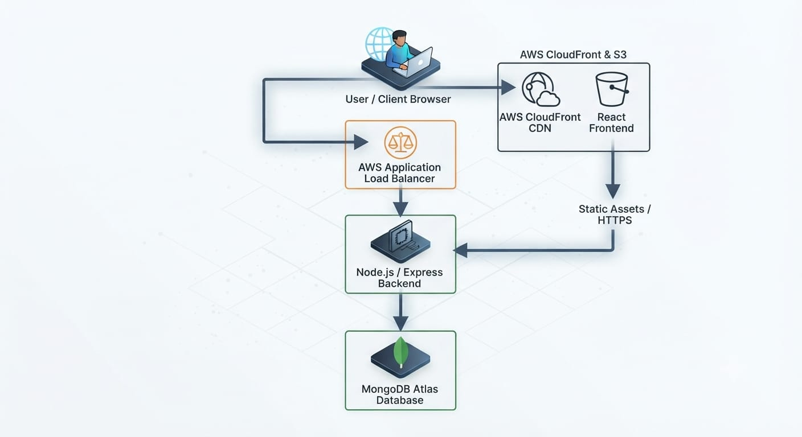
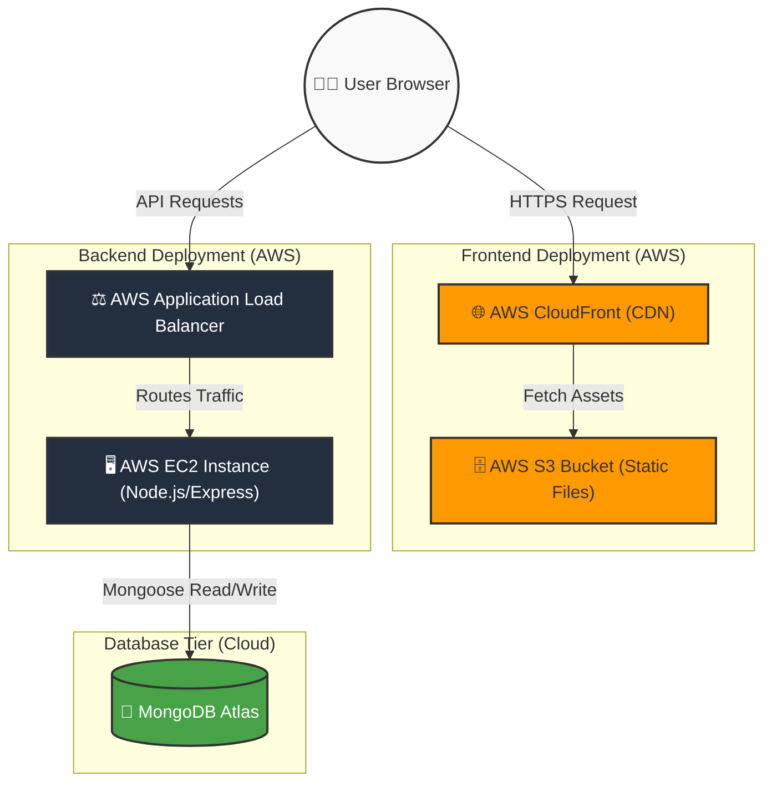
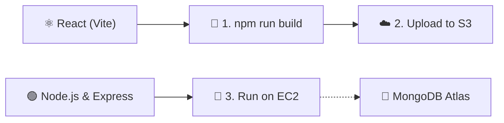

# Expense Tracker Deployment & Stack

```mermaid
graph TD
    %% Define styles
    classDef user fill:#f9f9f9,stroke:#333,stroke-width:2px;
    classDef frontend fill:#ff9900,stroke:#333,stroke-width:2px;
    classDef backend fill:#232f3e,stroke:#333,stroke-width:2px,color:#fff;
    classDef db fill:#47A248,stroke:#333,stroke-width:2px,color:#fff;

    %% Nodes
    User(("🧑‍💻 User Browser")):::user
    
    subgraph "Frontend Deployment (AWS)"
        CloudFront["🌐 AWS CloudFront (CDN)"]:::frontend
        S3["🗄️ AWS S3 Bucket (Static Files)"]:::frontend
    end
    
    subgraph "Backend Deployment (AWS)"
        ALB["⚖️ AWS Application Load Balancer"]:::backend
        EC2["🖥️ AWS EC2 Instance (Node.js/Express)"]:::backend
    end
    
    subgraph "Database Tier (Cloud)"
        Atlas[("🍃 MongoDB Atlas")]:::db
    end

    %% Connections
    User -- "HTTPS Request" --> CloudFront
    CloudFront -- "Fetch Assets" --> S3
    User -- "API Requests" --> ALB
    ALB -- "Routes Traffic" --> EC2
    EC2 -- "Mongoose Read/Write" --> Atlas
```

## Stack & Deployment Steps

```mermaid
flowchart LR
    %% Tech Stack Nodes
    React["⚛️ React (Vite)"]
    Node["🟢 Node.js & Express"]
    Mongo["🍃 MongoDB Atlas"]

    %% Deployment Step Nodes
    Build["🔨 1. npm run build"]
    S3Deploy["☁️ 2. Upload to S3"]
    EC2Deploy["🚀 3. Run on EC2"]

    %% Connections
    React --> Build
    Build --> S3Deploy
    
    Node --> EC2Deploy
    EC2Deploy -.-> Mongo
```
